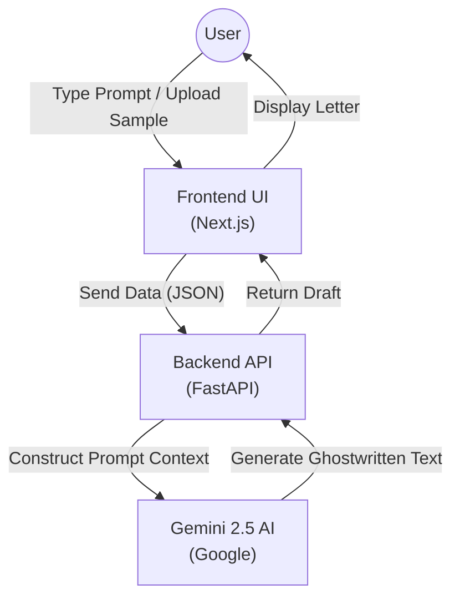

# GhostWriter AI ✍️

**GhostWriter AI** is a smart personal letter-writing assistant.  
It reads your sample texts or images to mimic your unique writing style (tone, vocabulary, structure) and generates professional letters that sound exactly like you.

---

## 🚀 How It Works (Workflow)

Here is the journey your data takes when you use the app:



**Text Workflow:**
`User Input` -> `Frontend` -> `Backend` -> `Gemini AI` -> `Backend` -> `Frontend` -> `User Screen`

---

## 🛠️ Quick Start

You can run the entire application (Backend + Frontend) with one command.

### 1. Simple Run
```bash
python run_app.py
```

---

## 🏗️ Architecture

- **Frontend**: Next.js 16 (React), Tailwind CSS.
- **Backend**: Python 3.11, FastAPI.
- **AI Engine**: Google Gemini (Multimodal).

---

## ❤️ Thank You
Thank you for using **GhostWriter AI**! Happy writing. ✍️
